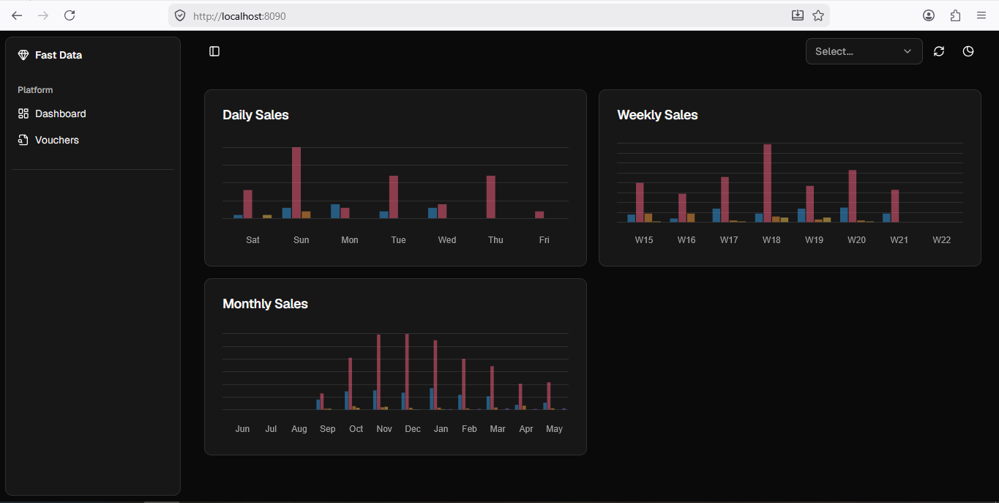
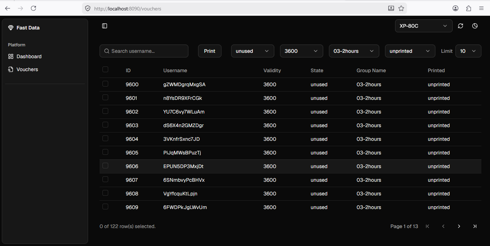
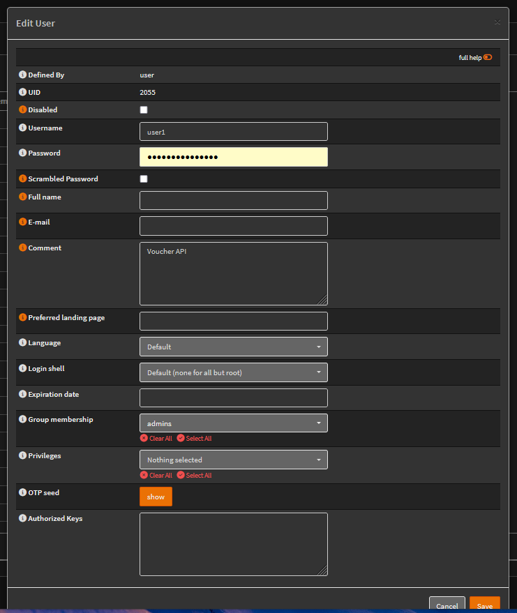
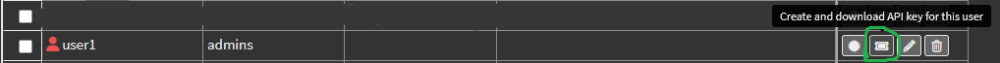

# About The Project

<!--  -->
<!--  -->


Dashboard


Vouchers

This project was created so that you can print using your opnsense vouchers using a thermal printer.
A lot of projects uses an A4 printer

### Built With

* 
* 


## Getting Started

### Prerequisites

* <a href="https://go.dev/" target="_blank">Go programming language</a>
* <a href="https://nodejs.org/en" target="_blank">Nodejs</a>
 
Check out the quick start on how to install these on your operating system 

### Installation

In your windows <a href="https://github.com/microsoft/terminal/releases/tag/v1.24.11321.0" target="_blank">terminal</a> (install if you do not have it) type:


```bash
git clone https://github.com/bkaradz/opnsense-hotspot.git my-app

cd my-app

npm install

go mod download

cp .env.example.windows .env
```

Change the API_KEY and the API_SECRET to reflect the values in your configuration

In opnsense: System > Access > Users
create a user as shown below and generate an API_KEY and API_SECRET by clicking on the icon shown in green



User



Create an API_KEY and API_SECRET keys

On the key BASE_URL and CAPTIVE_PORTAL_URL <ip address> enter the ip address of your router

and these keys:
SEARCH=
STATE=unused
VALIDITY=3600
GROUP_NAME=01-1hour
PRINTED=unprinted
LIMIT=10

are the defaults values in the vouchers page. The VALIDITY and GROUP_NAME keys are obtained from opnsense; Services > Captive Portal > Vouchers > Create Vouchers


```bash
make dev
```

Your app is now running at [http://localhost:8090]

## License

MIT


